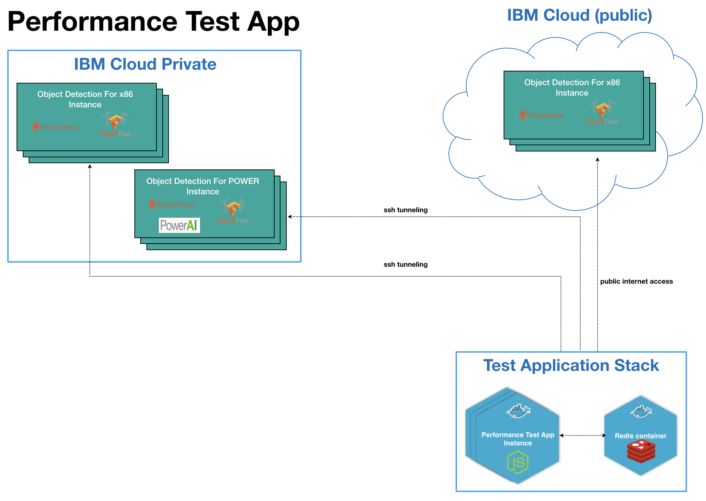

# Performance test component for Object Detection application

This application proides a consolidated dashboard to monitor/compare performance of Object Detection app running on different environments

The app uses node.js technology stack together with redis, websocket, etc to update the statistics on Web UI

## Architecture overview



The app is containerized in a Docker image. In order to run the app, you need to have Docker and docker-compose on your machine

To run the app, simply spin up the components by running this docker-compose command:

```
$ docker-compose up -d
```

Now you can access the app via this link: http://localhost:3000